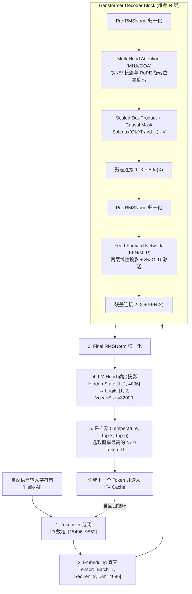
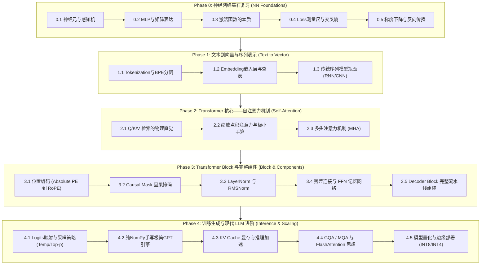

# 📘 Transformer & LLM 底层原理与神经网络交互式教材

> **面向资深系统 / 嵌入式工程师量身打造的硬核全景教材**  
> **核心学习闭环**：黑盒引入 → 可视化交互 → 极小规模手算 → NumPy 极简代码 → 物理数学直觉 → 真实工程细节

---

## 🌟 本书全景导读与工程哲学

### 1. 为什么写这本教材？
在绝大多数机器学习教材中，往往存在两种极端：
* **极端一（纯理论派）**：一上来堆砌大段复杂的线性代数与概率统计推导，对于数学知识长期未用、公式手算生疏的工程师极不友好；
* **极端二（调包调用派）**：只教如何 `import transformers` 或调用 API，把核心机理视为黑盒，无法满足希望深入理解底层运行机制、进行硬件加速与性能调优的工程师需求。

**本书专为具备成熟软件工程经验（C/C++、Linux、MCU、系统架构）的工程师设计**。我们把神经网络与 Transformer 视为一套**高精度、高并发的张量数字信号处理流水线**。我们将数学公式与硬件内存布局、张量维度（Tensor Shape）变换以及真实的矩阵运算紧密挂钩，带你从最底层的逻辑门/加权求和，一步步构建出完整的现代 LLM 推理引擎。

---

### 2. 核心教学与认知路线
为了彻底消除纸上手算卡顿与公式恐惧，本书所有章节严格执行以下递进链条：

```text
1. 它解决什么问题？ (工程师视角黑盒引入)
    ↓
2. 输入是什么？ (Tensor Shape, Data Type, 实际物理含义)
    ↓
3. 输出是什么？ (Tensor Shape 变换轨迹)
    ↓
4. 黑盒 JS 可交互动画体验 (控件/滑块/Canvas/按步执行)
    ↓
5. 极小规模人工计算 (2~3 维向量，消除纸上卡顿)
    ↓
6. Python / NumPy 代码实现 (简洁代码与手算一一对应)
    ↓
7. 数学原理与物理直觉 (按需触发，解释“为什么这样设计”)
    ↓
8. 打开黑盒：真实 Transformer 中的工程细节 (PyTorch/CUDA/NPU 视角)
    ↓
9. 动手实验与思考题 (参数调优与边界情况分析)
```

---

## 🧭 LLM 端到端全景数据流心智模型

在正式进入各章节前，可以通过下图建立大模型运行时的全局心智模型：



---

## 🗺️ 课程总览与学习路线 (Curriculum Roadmap)



---

## 📑 详细章节规划与交互设计

### Phase 0: 神经网络基石复习 (Neural Network Foundations)
*从硬件/系统工程师最熟悉的信号流动与矩阵流水线出发，快速重构数学手算与张量直觉。*

| 章节 | 文件名 | 核心内容与张量追踪 | 交互式 JS 实验设计 |
| :--- | :--- | :--- | :--- |
| **0.1 神经元与感知机** | `01_neuron_and_perceptron.html` | 线性加权求和、阈值触发、二分类决策超平面 | 2D 决策超平面滑块控制，实时观察直线旋转与平移 |
| **0.2 多层感知机与矩阵表达** | `02_mlp_matrix_representation.html` | $Y = X \cdot W + B$ 矩阵流水线、Tensor Shape 追踪 | 2D/3D 坐标网格矩阵仿射变换（拉伸/旋转/剪切） |
| **0.3 激活函数的本质与非线性** | `03_activation_functions.html` | 为什么多层线性等于单层？Sigmoid, ReLU, GELU, Softmax 对比 | 输入连续波形信号，动态观察各激活函数的输出截断与平滑效果 |
| **0.4 Loss 测量尺与交叉熵** | `04_loss_and_cross_entropy.html` | 误差度量、MSE 与 Cross-Entropy 几何物理含义 | 交互式概率分布调整仪，直观体验交叉熵 Loss 的非线性惩罚爆发 |
| **0.5 梯度下降与反向传播** | `05_gradients_and_backpropagation.html` | “盲人下山”直觉、计算图 (Computational Graph)、链式法则 | 2D/3D Loss 损失曲面小球滚落模拟器，观察学习率超调与鞍点停滞 |

---

### Phase 1: 文本到向量与序列表示 (Text to Vectors)
*将离散的自然语言字符转化为机器可计算的连续张量。*

| 章节 | 文件名 | 核心内容与张量追踪 | 交互式 JS 实验设计 |
| :--- | :--- | :--- | :--- |
| **1.1 Tokenization 与 BPE 算法** | `06_tokenization_and_bpe.html` | 字符 $\to$ ID 映射、Byte-Pair Encoding 合并算法 | 实时文本 Tokenizer 拆解器，高亮显示 Token 切分边界与 ID 数组 |
| **1.2 Embedding 嵌入层与语义空间** | `07_embedding_lookup.html` | Lookup Table 查表本质、高维密集向量、向量夹角余弦相似度 | 2D 语义向量投影仪，体验“国王 - 男人 + 女人 = 女王”向量空间运算 |
| **1.3 传统序列模型瓶颈** | `08_sequence_models_bottleneck.html` | RNN/LSTM 串行时序依赖、长程遗忘与无法并行吞吐的硬件痛点 | 串行时钟流水线 vs 并行广播处理的时序动画对比 |

---

### Phase 2: Transformer 核心——自注意力机制 (Self-Attention)
*彻底拆解 Transformer 最具突破性的核心架构。*

| 章节 | 文件名 | 核心内容与张量追踪 | 交互式 JS 实验设计 |
| :--- | :--- | :--- | :--- |
| **2.1 Q / K / V 检索机制物理直觉** | `09_qkv_intuition.html` | 数据库/图书馆检索隐喻：Query（查询）、Key（索引）、Value（内容） | 悬停 Token 动态探针，实时显示与其余 Token 的相关度得分 |
| **2.2 缩放点积注意力与极小手算** | `10_scaled_dot_product_attention.html` | $\text{Attention}(Q, K, V) = \text{softmax}\left(\frac{QK^T}{\sqrt{d_k}}\right)V$、$\sqrt{d_k}$ 缩放防梯度消失 | 动态点积热力图生成器，全流程显示点积、缩放、Softmax 与加权融合 |
| **2.3 多头注意力机制 (Multi-Head)** | `11_multi_head_attention.html` | 为什么需要分头？语法头、指代头、因果头；张量维度切分与合并 | 多头注意力分流与特征拼接重组动画 |

---

### Phase 3: Transformer Block 与完整组件 (Block & Components)
*从单个注意力算子扩展为工业级大模型骨架。*

| 章节 | 文件名 | 核心内容与张量追踪 | 交互式 JS 实验设计 |
| :--- | :--- | :--- | :--- |
| **3.1 位置编码 (Absolute PE 到 RoPE)** | `12_positional_encoding_and_rope.html` | 无序集合注入位置信息、正余弦绝对位置 vs 现代 RoPE 旋转位置编码 | 复平面 2D 向量旋转动画，直观感受相对距离与内积保留特性 |
| **3.2 Causal Mask 因果掩码** | `13_causal_mask.html` | 自回归 Decoder-Only 生成中的“不能偷看未来”机制、上三角 $-\infty$ 遮蔽 | 交互式 Mask 开关矩阵，对比 Encoder 全局注意与 Decoder 因果注意 |
| **3.3 LayerNorm 与 RMSNorm** | `14_layer_norm_and_rmsnorm.html` | 为什么深层网络需要归一化？LayerNorm vs BatchNorm 维度差异、RMSNorm 计算优化 | 3D 张量切片归一化动态立方体，实时观察均值中心化与方差缩放 |
| **3.4 残差连接与 FFN 记忆网络** | `15_residual_and_ffn.html` | $X + \text{SubLayer}(X)$ 梯度高速公路、两层 MLP 的知识存储与特征变换 | 深层网络反向传播信号衰减对比模拟器（有无残差） |
| **3.5 Transformer Block 整体组装** | `16_transformer_block_assembly.html` | Pre-LN 现代架构、输入到输出的全流程 Tensor Shape 变换追踪 | 单层完整 Block 张量流水线单步执行器 |

---

### Phase 4: 训练生成与现代 LLM 进阶 (Inference & Scaling)
*从单步推理到工业级大模型推理优化与量化加速。*

| 章节 | 文件名 | 核心内容与张量追踪 | 交互式 JS 实验设计 |
| :--- | :--- | :--- | :--- |
| **4.1 Logits 映射与采样策略** | `17_logits_and_sampling.html` | Hidden State $\to$ Vocab Logits、Temperature 调节、Top-k 与 Top-p (Nucleus) 采样 | 动态概率分布调节柱状图，实时体验 Temperature 变化对生成多样性的影响 |
| **4.2 极简纯 NumPy GPT 推理引擎** | `18_numpy_mini_gpt.html` | 不依赖 PyTorch，纯 NumPy 实现 200 行完整 GPT 前向推理流程 | 浏览器端纯 JS/WebAssembly 单步断点执行 GPT 前向推理 |
| **4.3 KV Cache 机制与显存加速** | `19_kv_cache_mechanism.html` | 自回归生成的冗余计算痛点、KV 缓存重用机制、显存占用精确公式 | Prefill 阶段 vs Decode 阶段 KV Cache 读写流水线动画 |
| **4.4 GQA 与 FlashAttention 思想** | `20_gqa_and_flash_attention.html` | MHA vs MQA vs GQA (Grouped-Query)、SRAM / HBM 带宽瓶颈与分块 Tiling 计算 | GPU 存储层级 (HBM vs SRAM) 数据搬运开销动态模拟器 |
| **4.5 模型量化与边缘部署** | `21_quantization_and_deployment.html` | FP32 $\to$ FP16 $\to$ INT8 / INT4、Weight-Only vs 激活量化、MCU/NPU 部署考虑 | 权重与激活值定点量化舍入误差与反量化交互对比仪 |

---

## 🎯 学习收获与终极能力清单

学完本套教程后，你将具备以下 7 级核心能力：
1. **架构全景洞察**：一眼看透 Transformer 架构图与任意维度的张量流动轨迹。
2. **源码级掌控力**：能够独立阅读并理解 PyTorch / llama.cpp / HuggingFace 等开源大模型的底层源码。
3. **从零手写实现**：能脱离任何深度学习框架，用纯 NumPy / C++ 手写出一个完整的迷你 GPT 推理核心。
4. **算子物理直觉**：对 Attention, RoPE, RMSNorm, Residual, Causal Mask 的物理数学含义了然于胸。
5. **计算图与反向传播**：清晰掌握 Forward / Loss / Backpropagation 的计算图推导逻辑。
6. **顶会论文阅读**：具备阅读 NeurIPS/ICLR/ACL 顶会论文的能力，不再畏惧矩阵与概率公式。
7. **底层工程加速**：深刻理解 KV Cache, GQA, FlashAttention 以及 INT8/INT4 量化背后的硬件访存与显存瓶颈。

---

## 🎨 页面排版与视觉规范

所有交互式 HTML 文档严格遵循统一的 `HTML及CSS报告风格与颜色标注规范.md`：
* **页面基调**：浅灰蓝背景（`#f6f8fb`）搭配纯白高品质主卡片容器（`#ffffff`，圆角 `14px`，外阴影）。
* **语义化文字高亮**：
  * <span style="color:#2563eb;font-weight:bold;">概念澄清（蓝 #2563eb）</span>：核心概念界定与关键术语边界。
  * <span style="color:#c2410c;font-weight:bold;">注意/限制（橙 #c2410c）</span>：特定约束、适用范围与易过度泛化点。
  * <span style="color:#dc2626;font-weight:bold;">危险/禁止（红 #dc2626）</span>：高危误区、禁止操作与不可信假设。
* **独立图表面板**：Mermaid 图与 Canvas 交互画布均采用白底细边框卡片独立承载，确保阅读体验舒适清爽。
